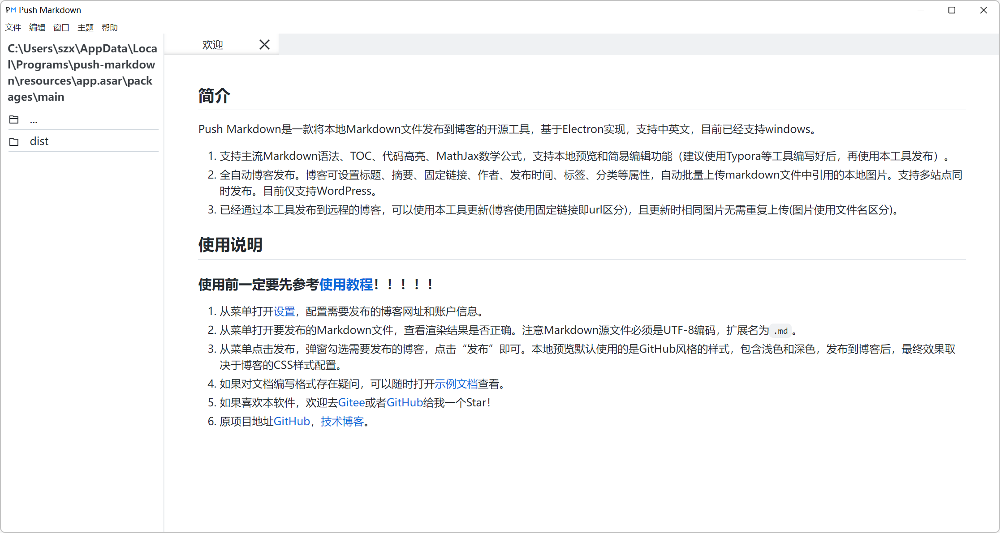

# Push Markdown

此代码是基于[Publish Markdown](https://github.com/jzj1993/PublishMarkdown)重构的。

原代码地址：https://github.com/jzj1993/PublishMarkdown

**使用前务必先查看**[**使用教程**](docs/使用教程.md)**！！！**

**使用前务必先查看**[**使用教程**](docs/使用教程.md)**！！！**

**使用前务必先查看**[**使用教程**](docs/使用教程.md)**！！！**

## 背景

由于原来的代码并没有进行更新维护，框架可能有点老，而且有时候有bug，因此萌生了用基于electron13、vue3和TypeScript重构代码的想法。

由于我本人并不会electron开发和vue开发，算是半个开发小白，所以也想借助最近搭建博客的热情来顺便重构一下这款软件的代码。毕竟兴趣是最好的老师，而且在别人的基础上前行，也是能够进步非常快的，希望我能够真正的完成这款软件的重构，一步一步个脚印，无限进步吧！

## 软件简介

**Push Markdown** 是一款将本地Markdown文件发布到Wordpress和cnblogs的开源工具，基于Electron实现，支持中英文，目前支持windows和macos（个别版本）。

1. 支持主流Markdown语法、TOC、代码高亮、MathJax数学公式，支持本地预览和简易编辑功能（建议使用Haroopad、Typora等工具编写好后，再使用本工具发布）。
2. 全自动博客发布。博客可设置标题、摘要、固定链接、作者、发布时间、标签、分类等属性，自动批量上传markdown文件中引用的本地图片。
3. 对文章上传逻辑和图片上传逻辑进行了优化，不仅只依赖本地缓存，这样能适应多台设备和新装软件的情况，详情逻辑可以查看我的[技术博客](https://szx.life/push-markdown/push-markdown重构)。

## 使用事项

- **务必先查看**[**使用教程**](docs/使用教程.md)**！！！**
- CDN设置了IP访问限频配置，访问阈值设请不要设置太低。访问阈值就是每秒钟访问网页的次数。由于图片上传逻辑中，会检测网页中的图片是否还存在，因此当文档的图片太多时，很可能检测的次数会超过这个CDN设置的访问阈值，导致检测失败，强制更新图片，这样子会造成的一定的流量浪费并延长上传时间。
- 注意锚点的使用，建议按照规范来，最好不要出现标点符号，虽然我们已经做过适配了。空格使用短横杠 "-" ，英文字母小写。如果有想要typora中tab的效果，请使用全角空格进行替代。

## 其他文档

[心得体会](docs/心得体会.md)

[项目搭建](docs/项目搭建.md)

[push-markdown 示例文档 – 巷子深的生活 (szx.life)](https://szx.life/sample-docs-1/)

## 重要版本

**v1.2.4**

- 去掉/优化滚动条样式
- 在发布界面显示本地缓存的文章ID

**v1.2.3**

- 文件排序按照自然人的理解，即字符串中含有数字，将按照数字大小排序
- 刷新时状态栏给出提示
- 上传每张图片的时候状态栏给出提示

**v1.2.2**

- 自动检测新增不检查网络图片，仅利用本地缓存，大大加快发布速度
- 手动发布新增使用远程文章的网络图片来更新本地缓存，具体看使用教程

**v1.2.1**

- 再次修复锚点的问题（每次修复锚点都会有新的bug）
- 修改刷新文件的逻辑，不再卡顿，变得丝滑

**v1.2.0**

- 软件适配macos
- 博客适配cnblogs博客园
- 新增主题切换，多款主题任你挑选
- 新增侧边文件资源管理栏，可以快速打开同级目录下的文件
- 修复本地锚点中有中英文标点符号不能跳转的问题
- 修复图片绝对路径使用\作为分隔符不能正常显示的问题
- 修复了图片名称中含有中文从而导致网络检测失败的问题
- 美化了滚动条
- 修复滚动条高度不对的bug
- 修复界面文本框拖拽的问题
- 更新了使用文档
- electron升级到16

**v1.1.2**

- 新增url拼音转换，当url设置为空时，会将标题转换为拼音url格式
- 更新了一波依赖，electron升级到15.2（腹泻式更新）

**v1.1.1**

- 限制electron只能开一个应用
- 更换sample文档的网络图片源地址，垃圾github加载不出来
- 修复修改wordpress的脚本错误

**v1.1.0**

- 将electron升级为14（是的，我是个升级怪）
- 半修复锚点，如果想实现tab的效果，那么需要用全角中文来替换标题
- 加入一键重载的按钮，原理很简单，先关闭再打开（懒）
- 将tab转换为全角空格，因为这样子源码好看点，没有丑陋的emsp
- 重新加入MathJax，有万能的markdown-it库，直接搞定。

**v1.0.6**

​	这版主要是修复bug

- 将webSecurity重新改为true，相关的网络操作提前在preload里加载，舒服了。
- 半修复TOC目录代码，在软件里依旧不能跳转，但上传到博客后能够正确跳转，后续可能不修复了，毕竟TOC目录没有必要，typora会自动生成，我的博客也会自动生成。
- 修复点击示例文档没有相关文件。
- 修复主页点击sample样例没有反应。
- 修复点击外链是页内跳转的问题。

**v1.0.5**

- 图片居中
- 修复tab转换为emsp的问题，之前为全局替换，会把代码的tab也给替换，现在只替换普通文本的tab
- 新增脚本替换Wordpress
- 修复保存标签栏的历史状态bug
- 修复没有修改状态的保存

**v1.0.4**

​	对图片上传的逻辑进行了优化，也是因为多台设备和远程可能删除篡改图片的问题。

​	现在的逻辑是如果在手动模式下，选择了强制更新图片，那么就会强制覆盖原来有的图片，而且不会生成新的图片。自动覆盖的代码也需要修改wordpress的部分代码，因为wordpress的xmlrpc原本的逻辑是会生成-1,-2这样后缀的图片，而不会覆盖原来的图片，所以需要加一小段。

​	如果在手动模式下的不强制更新图片或者自动模式，那么就会检查本地缓存和远程URL有没有图片记录，如果都有，那么就不会更新图片，即便图片已经经过了修改（只看文件名称）。如果没有，那么也会进行覆盖更新。

​	因此我的建议是，在远程删除了图片，或者本地修改了图片，那么就强制更新图片，自动模式不一定有效，因为有时候还有CDN的效果，即使删除了图片，CDN还有缓存，会有影响。

​	因为wordpress5.8现在支持webp格式，因此上传也需要支持webp图片格式，就一行代码的事情。

**v1.0.3**

​	对文章上传到Wordpress进行了逻辑优化，起因是开发软件的时候老是多次安装，甚至清缓存，或是多台设备试用这个软件，或者wordpress删除了文章，这就会导致原来的逻辑代码不能够适用。

​	目前的更新逻辑为下：

1. 手动确认：先模式一；若指定ID为0，则模式二；若模式二失败，则模式三；若模式三失败，则模式四；
2. 自动判断：先模式二；若模式二失败，则模式三；若模式三失败，则为模式四；
3. 创建新文章：直接模式四；

- 模式一：更新指定文章ID
- 模式二：更新本地缓存获取的文章ID（相同的URL）
- 模式三：更新远程获得的文章ID（相同的标题，因为获取所有的文章，包括内容，比较费流量）
- 模式四：创建新的文章

​	手动更新适用于第一次使用软件，或者是换了一台设备更新文章，那么就可以指定文章ID来使当前这次能够成功更新，并且在本地缓存了更新后的ID。

​	自动判断适用于就一台设备，而且有本地缓存的情况，当然没有也能够自动获取远程文章ID，除了费流量没啥硬伤。

**v1.0.0**

​	终于完成了1.0.0的版本建设，10天的工作量，终于差不多把原来的源代码全部挪过来，逻辑和方法都没改，就是变成TypeScript（AnyScript😁）。虽然现在还有很多很多问题，比如去除了MathJax，因为原来的代码不能试用，而且我也没有这方面的需求，还有图片上传逻辑等等，但毕竟现在能用，就已经大告成功了。

​	可以推送博客了，好耶 ( •̀ ω •́ )✧。

## 待做

- [ ] ~~v-html改为组件模版，为了安全。~~（懒，问题不大）
- [ ] ~~标题栏和菜单栏实现~~。（懒，不想实现）
- [x] ~~文章图片cache基类这个逻辑可能还需要再重新写一遍，目前觉得用md5进行重写会不会合适一点？本地记录一下图片的名称和md5，然后比对。~~（不用md5，因为麻烦，还耗费资源，目前没看到必要性，详细看1.0.4）
- [x] ~~一个tab键转换的时候会变成一个空格键，希望能够变成一个全角空格~~（~~已经修复，直接将`\t`替换`&emsp;`就行~~~~了 ）~~~~（又修改了一遍，将\t替换为全角空格）。
- [x] mathjax实现，不一定做，因为现在没用到，而且很麻烦。
- [x] 图片居中
- [x] 记录文件打开历史
- [x] 文件修改后有标记
- [x] 能够有一键重载文件的按钮
- [ ] 使用typescript（即不要全用any）
- [ ] 改成vue3格式
- [x] 左侧使用类似Typora的文件管理的效果
- [x] 适配cnblogs~~，oschina（没文档，不行）~~
- [x] 可选markdown的渲染样式

## 其他人的项目

推送到其他博客的：

写作助手：[BlogHelper](https://github.com/onblog/BlogHelper)

博客园上传markdown文件：[pycnblog](https://github.com/dongfanger/pycnblog)

苹果用户非常棒的Markdown写作软件——MWeb：https://zh.mweb.im/
